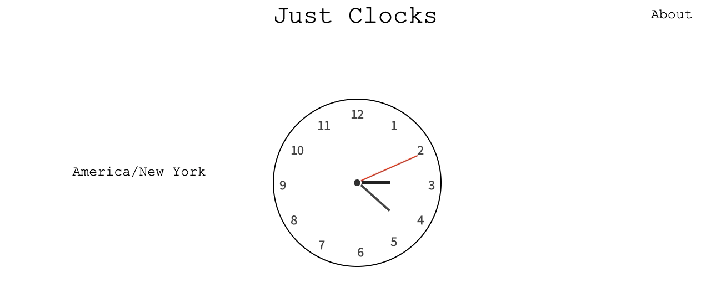
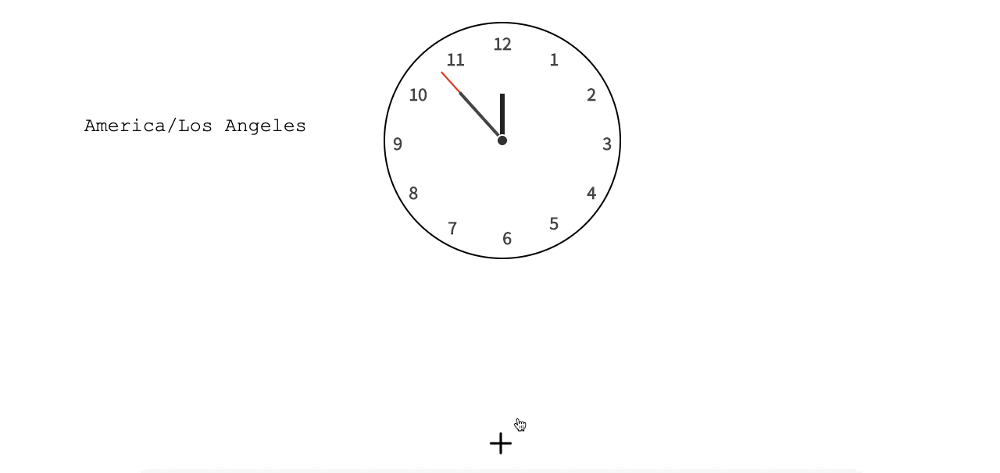
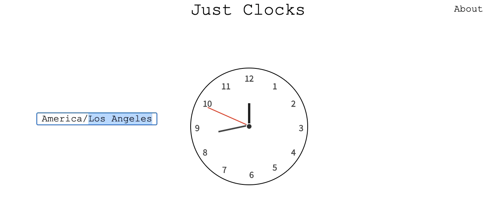

<!-- PROJECT LOGO -->
<br />
<p align="center">
  <a>
    
  </a>

  <h3 align="center">Just Clocks</h3>

  <p align="center">
    Analog clocks brought to life with React.JS and SASS!
    <br />
</p>

<br />
<br />

<!-- TABLE OF CONTENTS -->
<details open="open">
  <summary>Table of Contents</summary>
  <ol>
    <li>
      <a href="#about-the-project">About The Project</a>
      <ul>
        <li><a href="#built-with">Built With</a></li>
      </ul>
    </li>
    <li>
      <a href="#getting-started">Getting Started</a>
      <ul>
        <li><a href="#prerequisites">Prerequisites</a></li>
        <li><a href="#installation">Installation</a></li>
      </ul>
    </li>
    <li><a href="#license">License</a></li>
    <li><a href="#acknowledgements">Acknowledgements</a></li>
  </ol>
</details>


<!-- ABOUT THE PROJECT -->
## About The Project

 

Ever wanted to track the time in a specific time zone but in analog form? Just Clocks does just that by displaying an analog clock with the adjusted time! 

You can also:
* Add up to five animated analog clocks to the display, each with its own changeable timezones! :alarm_clock:

<a>
  
</a>

* Adjust the timezone by clicking on the current timezone next to the respective clocks! :alarm_clock:

<a>
   
</a>
< br/>

This is all made possible with the power of React Hooks, CSS, SASS, and ES6. :hourglass:

### Built With

Here are the tools used to create this project:

<p>
  
  
  
  
</p>

Additionally:

<li href="https://reactjs.org/docs/hooks-intro.html">React Hooks</li>
<li href="https://www.w3schools.com/js/js_es6.asp">ES6</li>  

## Getting Started

To get your own instance running, all you need to do is grab a copy of this repository, install the necessary dependencies and run the node server! Below is a more in-depth walkthrough on how to achieve just that:

### Prerequisites

You'll need to have git installed to clone the repository.

  ```sh
  brew install git
  ```

### Installation

1. Clone the repo
   ```sh
   git clone https://github.com/martinsung00/just_clocks
   ```
2. Initialize the repo
   ```sh
   npm run init
   ```
3. Create bundle.js
   ```sh
   npm run build
   ```
4. Update .envSample file
   ```JS
   ## Environment ##
   MODE=development
   
   ## Production ##
   PROD_PORT=YOUR_PORT
   
   ## Development ##
   DEV_PORT=YOUR_PORT
   ```
5. Change .envSample filename to .env
6. Start the server
   ```sh
   npm run build
   ```
7. Type in localhost:YOUR_PORT

## License


## Acknowledgements
* [Transitions and Transforms](https://www.webpagefx.com/tools/emoji-cheat-sheet)
* [React Use Effect](https://reactjs.org/docs/hooks-effect.html)
* [Analog Clock with React](https://codesandbox.io/s/idkpz?file=/src/Clock.js)
* [Best Readme Template](https://github.com/othneildrew/Best-README-Template/blob/master/README.md)
* [Img Shields](https://shields.io)
* [Simple Icons](https://simpleicons.org/)

